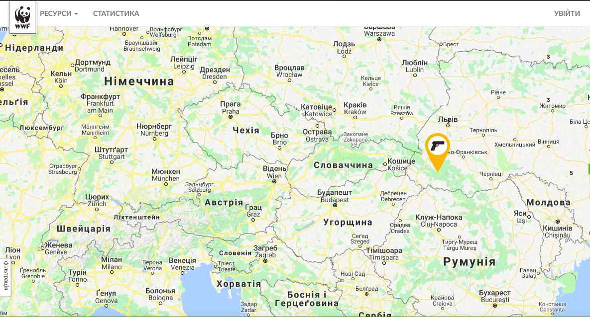

# Ecomap project on k8s
## Purpose and overview
This project represents kubernetes ready versions of both ecomap WSGI frontend application and custom build of official MySQL:5.7 docker image with data dump injected.

Both images have been already built and pushed to DockerHub:
- Ecomap [Docker image](https://hub.docker.com/r/leo160886/ecomap/) and [Dockerfile](ecomap_dockerized/Dockerfile)   
- MySQL [Docker image](https://hub.docker.com/r/leo160886/mysql-ecomap/) and [Dockerfile](ecomap_mysql_dockerized/Dockerfile)

## How to run
### Prerequisites
- Running kubernetes cluster (for testing purposes we used versions 1.9.5 and 1.11.3)
- Kubectl configured to perform deployment tasks
- Access to DockerHub in order to pull images

### Setup guide
I. Clone this repo:

  `git clone https://github.com/Glibovitskiy/ecomap_k8s.git`

II. Create secret holding MySQL root password:

  `kubectl create secret generic mysql-pass --from-literal=password=YOUR_PASSWORD`

  **YOUR_PASSWORD** should be changed to new password, secret name **mysql-pass** and secret key **password** should not be changed since they are referenced in deployment manifests

III. Modify LoadBalancer service:

  Since we are running LoadBalancer service on baremetal we can not summon cloud-specific load balancer and should pin our application frontend to the external ip of any of the kubernetes nodes

  In [file](k8s_deployments/ecomap-deployment.yaml) line **15** should be replaced with any external ip of node running kubernetes

IV. Run deployments:

   Deployment manifests can be located in [k8s_deployments folder](k8s_deployments)
   - create database deployment:

     `kubectl create -f mysql-deployment.yaml`

   - create application deployment:

     `kubectl create -f ecomap-deployment.yaml`

V. Verifying deployment:

   - pod verification:

    ```
    $ kubectl get pod
    NAME                           READY     STATUS    RESTARTS   AGE
    ecomap-6875f54555-5pffk        1/1       Running   0          8s
    ecomap-6875f54555-t24xl        1/1       Running   0          8s
    ecomap-mysql-d74459b94-f7lxm   1/1       Running   0          14s
    ```     
   - service verification:

    ```
    $ kubectl get service
    NAME           TYPE           CLUSTER-IP      EXTERNAL-IP      PORT(S)        AGE
    ecomap         LoadBalancer   10.233.39.162   192.168.57.106   80:31311/TCP   16s
    ecomap-mysql   ClusterIP      10.233.12.69    <none>           3306/TCP       23s
    kubernetes     ClusterIP      10.233.0.1      <none>           443/TCP        4h
    ```

   - frontend verification:

     simply go to ip of node modified in step 3 of this manual via any browser:

     
